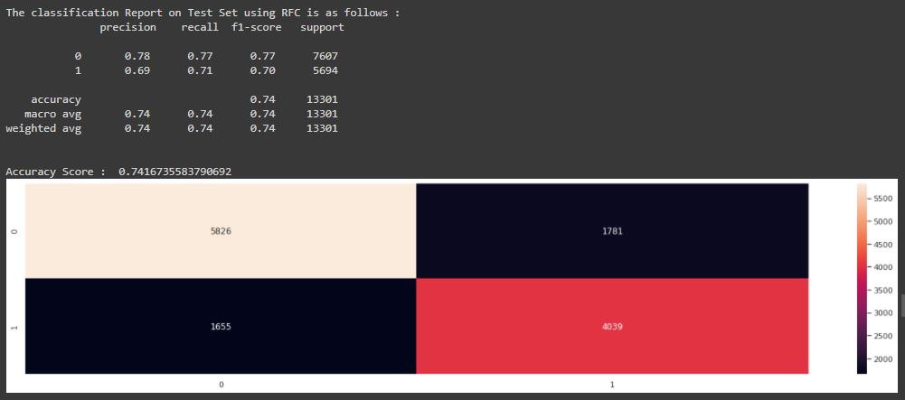
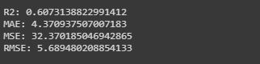

# Starbucks-Offers-Advertisement-Data-Analysis

 

## Business Objectives :

This is a customer segmentation problem for different types of advertisements on the Starbucks rewards mobile app. Customers respond differently to various types of promotions, so there is no 1 promotion type that is universally best for all customers. With a better understanding of customer behavior, Starbucks would be able to optimize how advertisements are sent to their customers.

The purpose of this project is to : 
1. Exporatory Data Analysis
2. Segment demographic groups based on how customers respond best to which offer type
3. Build a classifier that predicts whether or not customer will respond to an offer
4. Build a regressor that predicts the amount spent by a customer based on the offer sent to them

## Data Collection :

The dataset has been obtained from Udacity Capstone Challenge.

This data set contains simulated data that mimics customer behavior on the Starbucks rewards mobile app. This is a simplified version of the real Starbucks app because the underlying simulator only has one product whereas Starbucks actually sells dozens of products.

Once every few days, Starbucks sends out an offer to users of the mobile app. An offer can be merely an advertisement for a drink or an actual offer such as a discount or BOGO (buy one get one free). Some users might not receive any offer during certain weeks and not all users receive the same offer.

The data is contained in three files:

1.   portfolio.json - containing offer ids and meta data about each offer (duration, type, etc.)
2.   profile.json - demographic data for each customer 
3.   transcript.json - records for transactions, offers received, offers viewed, and offers completed

Here is the schema and explanation of each variable in the files:
1. portfolio.json
* id (string) - offer id
* offer_type (string) - type of offer ie BOGO, discount, informational
* difficulty (int) - minimum required spend to complete an offer
* reward (int) - reward given for completing an offer
* duration (int) - time for offer to be open, in days
* channels (list of strings)

2. profile.json

* age (int) - age of the customer
* became_member_on (int) - date when customer created an app account
* gender (str) - gender of the customer (note some entries contain 'O' for other rather than M or F)
* id (str) - customer id
* income (float) - customer's income

3. transcript.json

* event (str) - record description (ie transaction, offer received, offer viewed, etc.)
* person (str) - customer id
* time (int) - time in hours since start of test. The data begins at time t=0
* value - (dict of strings) - either an offer id or transaction amount depending on the record

Moreover, some further information given about the offers is that there are 3 different offer types:

* BOGO - buy one get one free
* Discount - discount with purchase
* Informational - provides information about products

## Modelling :

The following modelling approach was used in the project:

1. Loading and cleaning the raw data
2. Exploratory Data Analysis
3. Customer Segmentation using FMT and KMeans Clustering
4. Building a classifier to predict whether a customer will respond to an offer
5. Building a regression model to predict the amount spent by a customer based on the offer sent to them

The detailed analysis and model creation can be found in the .ipynb file. 

## Result :

Some of the test images are given below.

The performance of classifier is as follows:

The performance of regressor is as follows:

## Conclusions :

1. **Exploratory Data Analysis:**
    - We began with various data cleaning and preprocessing steps in order to transform the raw data into a usable format. This included dropping missing data, dropping duplicate data, converting colunms to the appropriate data types, extracting data from columns that contained lists or dictionaries, and mapping offer and user ID hash strings to numbers for simplicity. 
    - A little over 10% of users were missing demographic data so they were dropped entirely, since the purpose of this project is to segment users into demographic groups.
    - We explored the recorded events in order to answer the following questions about the offers and users:
      1. How many offers of each type were sent out?
      2. How many reward offers were completed?
      3. How many informational offers were followed by transactions?
      4. Which offers had the highest completion rate?
      5. How are customer demographics distributed?
      6. How are customer demographics distributed in each group?
      7. Are there any patterns in customer spending?
      8. Are there any demographic patterns in offer completion?

2. **Customer Segmentation:**
  - We used 2 different methods to segment customers:
  1.  Quantile segmentation with frequency, monetary value, and tenure (FMT) -
      - This method focused primarily on the spending behavior of customers on the app and created segments based on the number of transactions made during the month, the total amount spent during the month, and how long the customer has been using the app.
  2. K-means clustering - 
      - This method combined user demographic with FMT features and created clusters from linear combinations of these features.
      - The features were not used directly with K-means clustering because one of the demographic features (gender) is categorical
      - Principal component analysis (PCA) was used to create 5 components (which are linear combinations of the features) that explained almost 95% of the variance in the data.

3. **Classifier for Offer Response:**
  - We built a classifier that predicts whether a customer will complete an offer. 
  - The process began with some data preprocessing, which included extracting the received offers (the data of interest), encoding the categorical variables into numerical data, creating the target label (defined as 1 if the user viewed and then completed the offer or 0 otherwise).
  - The ANN classifier had the best prediction performance with an F1 score of 0.70 and 0.74 on the test set.

4. **Regressor to predict Amount spent by Customer:**
  - The regression model to predict how much someone would spend given an offer was sent perhaps we can assess which offers bring in the most revenue. 
  - However, my model found virtually no correlation between the features provided (namely, offer characteristics and demographics of app users) with the amount spent per user. These features aren't strong enough to predict the amount spent per user. 
  - With the available data, we used the Light GBT Regressor to estimate the amount spent by the customer given they were sent out an offer. The R2 score was 0.61 and RMSE score was 5.69.
